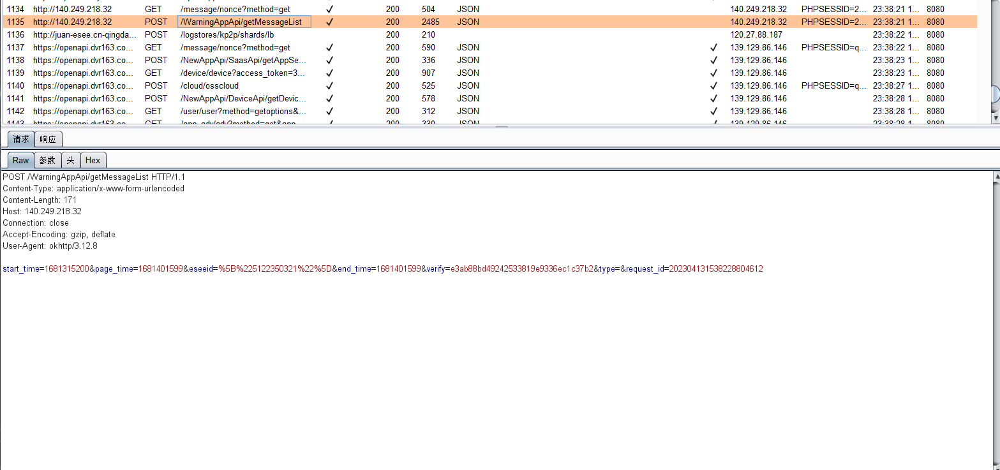
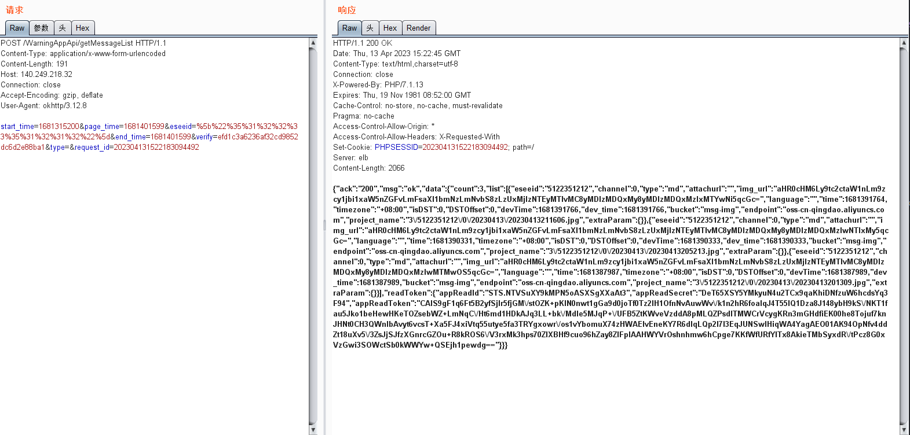

# com.generalcomp.luowice 3.5.18 has Insecure Permission

## Vulnerability Type:
Insecure Permission

## Vulnerability Version:
3.5.18

## Recurring environment
≥Android 7.0

## Vulnerability Description AND recurrence:

Modify "eseeid" to any other field and use BASE64 encoding to access alarm information for different devices

The "img_url" in the response body is decoded by BASE64 and is the image taken in the alarm message of the device, which is not further used for ethical reasons