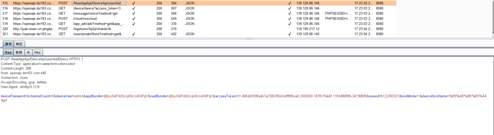
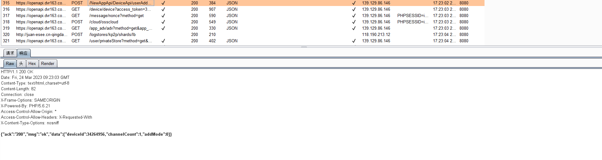

<!--
 * @Author: zzh
 * @Date: 2023-04-23 10:23:13
 * @Description: 
-->

# com.generalcomp.luowice 3.5.18 has Incorrect Access Control

## Vulnerability Type:

Incorrect Access Control

## Vulnerability Version:

3.5.18

## Recurring environment

≥Android 7.0

## Vulnerability Description AND recurrence:

When adding a device, the device ID is included in the add request, present as "eseeid"

If the "eseeid" is modified through the traversal, it may bind to all online devices with unchanged passwords, resulting in incorrect access control which is different from getting alarm message vulnerability

