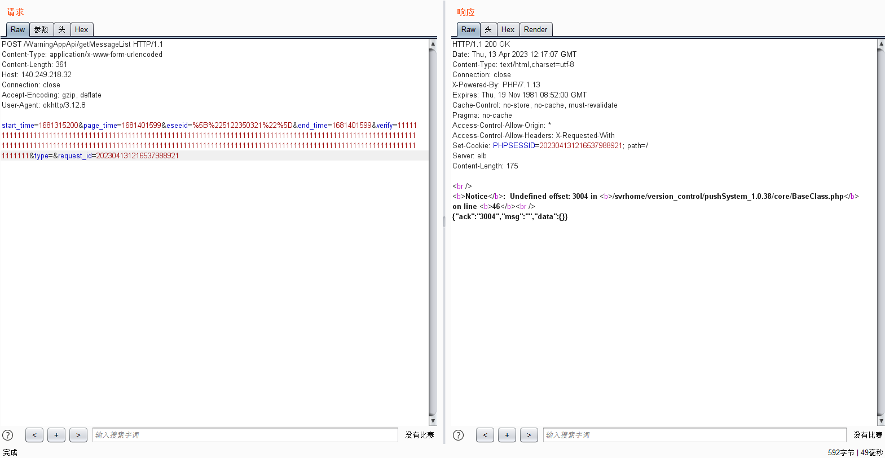

# com.generalcomp.luowice 3.5.18 has Incorrect Access Control

## Vulnerability Type:

Incorrect Access Control

## Vulnerability Version:

3.5.18

## Recurring environment

≥Android 7.0

## Vulnerability Description AND recurrence:
When fetching warning messages, modifying the Verify field will lead to the disclosure of cloud source code information, which may be further exploited
