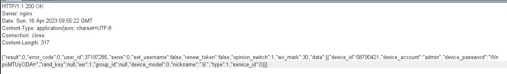
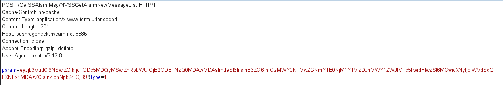
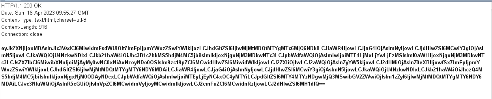

<!--
 * @Author: zzh
 * @Date: 2023-05-17 10:26:20
 * @Description: 
-->
# com.macrovideo.v380pro 1.4.97 has Incorrect Access Control

## Vulnerability Type:

Incorrect Access Control

## Vulnerability Version:

1.4.97

## Recurring environment

≥Android 7.0

## Vulnerability Description AND recurrence:

When someone shares the device, the cloud service sends device_id and password of the device to the user

Although the device owner unshares the device, the user can still get alarm message with the device id and device password （The image content is BASE64 encoded）

