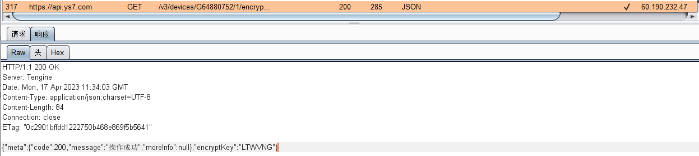
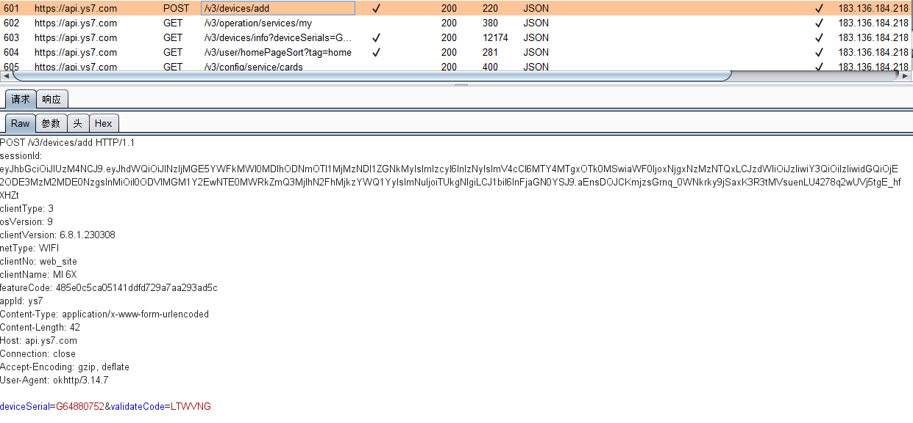
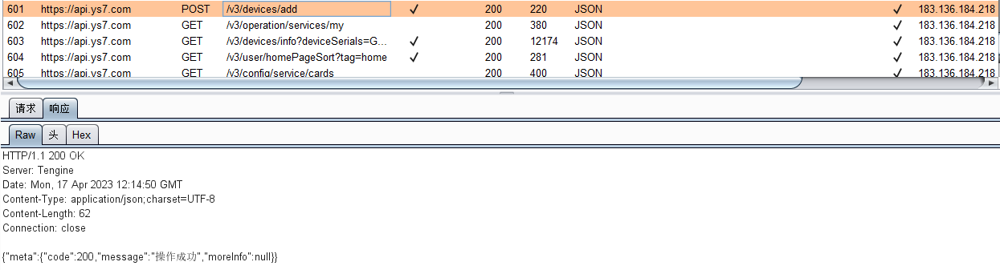

# com.videogo 6.8.1 has Incorrect Access Control

## Vulnerability Type:

Incorrect Access Control

## Vulnerability Version:

6.8.1

## Recurring environment

≥Android 7.0

## Vulnerability Description AND recurrence:

When someone shares the device, the cloud service sends the password of the device to the user

Although the device owner unshares the device, the user can still bind the device with the device number and device password

