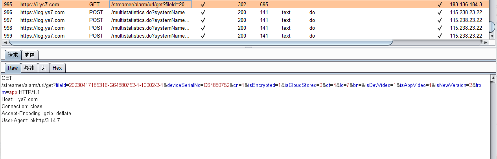
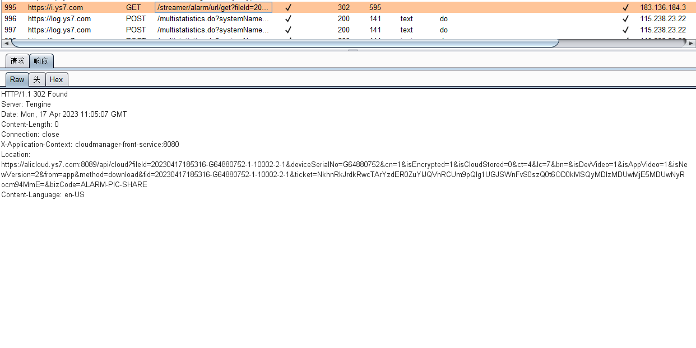
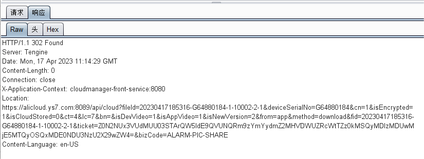

# com.videogo 6.8.1 has Incorrect Access Control

## Vulnerability Type:

Incorrect Access Control

## Vulnerability Version:

6.8.1

## Recurring environment

≥Android 7.0

## Vulnerability Description AND recurrence:

When obtaining alarm information, the device ID is included in the request, The picture in the response is in the Location field

After changing the device ID, you can get the image URL of the corresponding device
